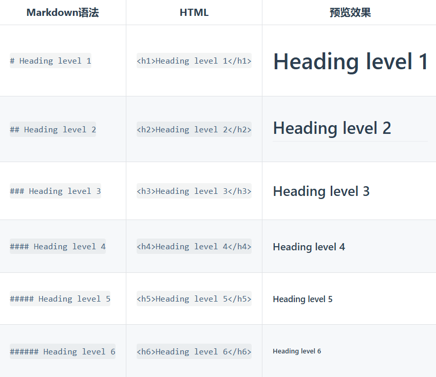

# Markdown 基本语法

笔记来源：[Markdown 教程]（https://markdown.com.cn/）

## Markdown 标题语法

- 要创建标题，请在单词或短语前面添加井号 (#) 。# 的数量代表了标题的级别。例如，添加三个 # 表示创建一个三级标题 (<`h3`>) (例如：### My Header)。  
  

- 可在文本下方添加任意数量的 == 号来标识一级标题，或者 -- 号来标识二级标题。

- 兼容问题
不同的 Markdown 应用程序处理 # 和标题之间的空格方式并不一致。为了兼容考虑，请用一个空格在 # 和标题之间进行分隔。
